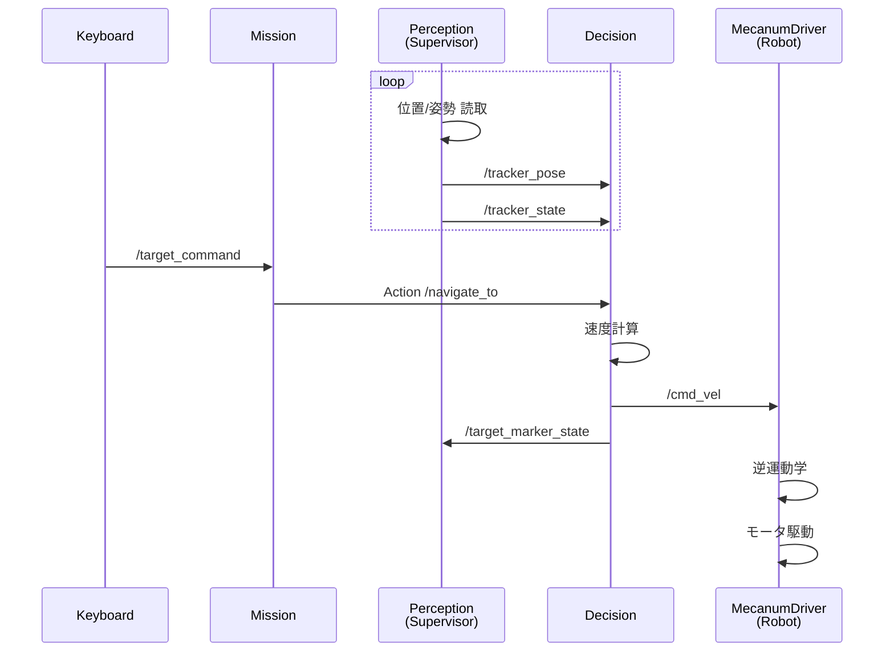

```mermaid
sequenceDiagram
    participant K as Keyboard
    participant M as Mission
    participant P as Perception<br/>(Supervisor)
    participant D as Decision
    participant MD as MecanumDriver<br/>(Robot)

    loop
        P->>P: 位置/姿勢 読取
        P->>D: /tracker_pose
        P->>D: /tracker_state
    end

    K->>M: /target_command
    M->>D: Action /navigate_to

    D->>D: 速度計算
    D->>MD: /cmd_vel
    D->>P: /target_marker_state
    MD->>MD: 逆運動学
    MD->>MD: モータ駆動
```
