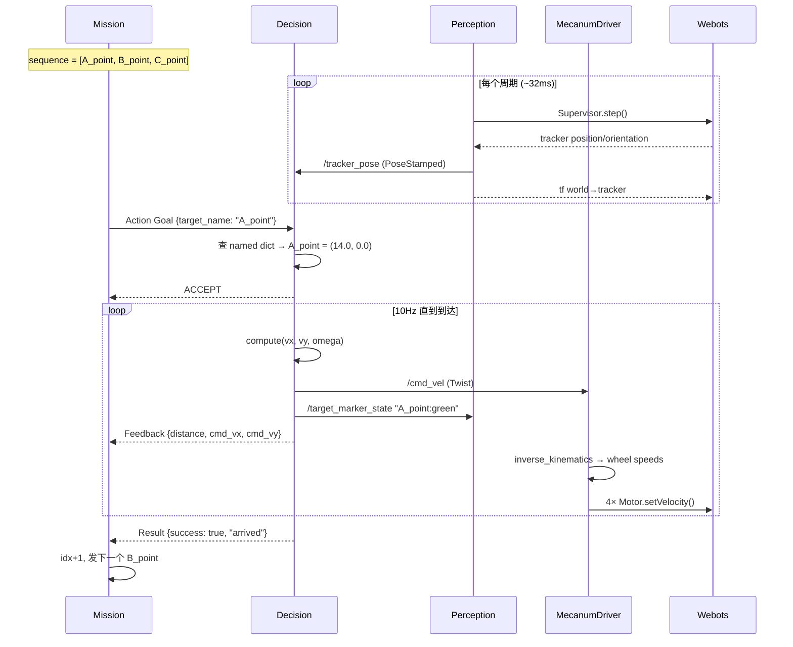
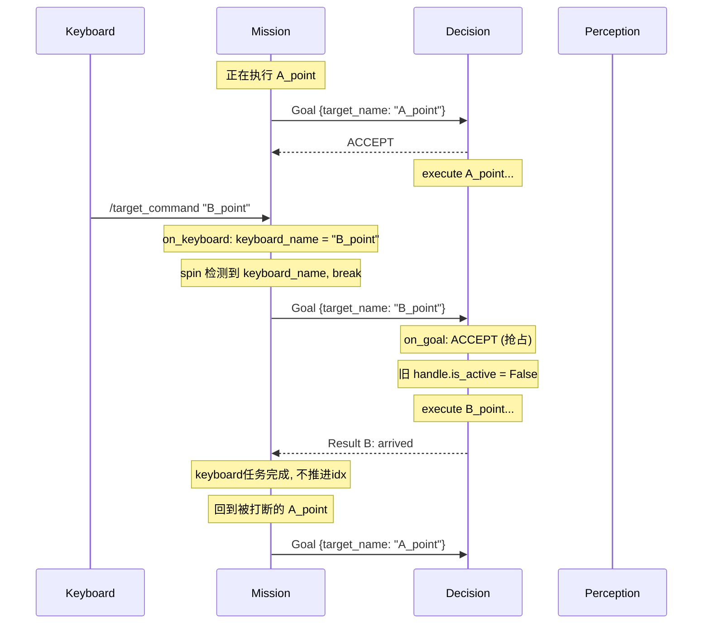
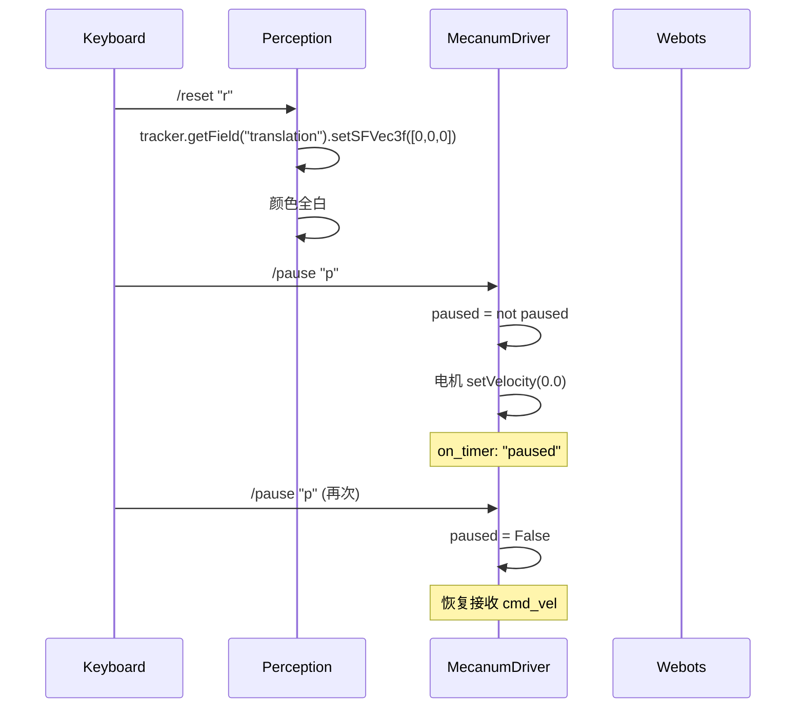
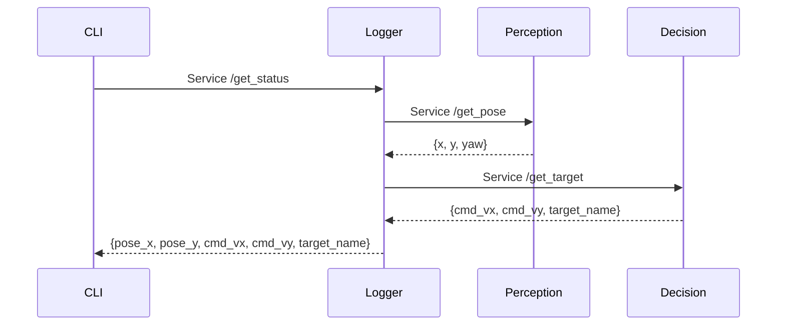

# ROS2 Mecanum Patrol — 时序图

## 1. 正常巡逻 (Mission A→B→C)



## 2. 键盘抢占



## 3. Reset / Pause



## 4. Service 状态查询



## 5. 通信总览

```
                     ┌──────────────┐
                     │   Keyboard   │
                     └──┬───┬───┬──┘
          /target_command│   │   │ /reset, /pause
                     ┌───┘   │   └──────────┐
                     ▼       │              ▼
                 ┌───────┐   │    ┌──────────────┐
                 │Mission│   │    │  Perception  │◄─── Supervisor ── Webots
                 └───┬───┘   │    └──────┬───────┘
       Action        │       │           │ /tracker_pose
    /navigate_to     │       │           │ /tracker_state
                     ▼       │           ▼
                 ┌──────────┴───────────┐
                 │      Decision        │
                 └──────────┬──────────┘
                            │ /cmd_vel
                            │ /target_marker_state
                            ▼
                 ┌──────────────────────┐
                 │   MecanumDriver     │──► Webots motors
                 └──────────────────────┘
                        ▲
            /pause      │
                 ┌──────┘
                 │ Keyboard (r/p)
                 └──────────────────────┘
                        │
            /reset      ▼
                 ┌──────────────┐
                 │  Perception  │──► teleport
                 └──────────────┘

    Topic:
      /target_command      Keyboard → Mission
      /tracker_pose        Perception → Decision
      /tracker_state       Perception → MecanumDriver
      /cmd_vel             Decision → MecanumDriver
      /target_marker_state Decision → Perception
      /reset               Keyboard → Perception
      /pause               Keyboard → MecanumDriver

    Action:
      /navigate_to         Mission → Decision

    Service:
      /get_status          Logger (call /get_pose + /get_target)
      /get_pose            Perception
      /get_target          Decision
```
